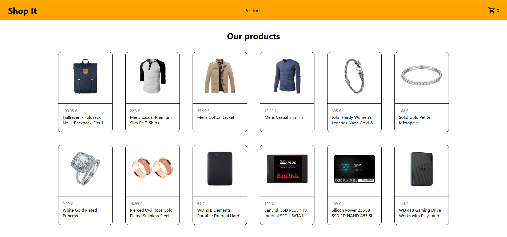

# Shop It

An online shop mockup built on React that fetches data from [Fake Store API][fake-stor-api-url]



## Overview

This app allows users to explore all the items of the shop, add them to their cart, and edit it if needed however they want.
It uses the [Fetch API][fetch-api-url] to get product data from [Fake Store API][fake-stor-api-url], and uses [React Router][react-router-url] to eliminate the need of routing to multiple HTML files.

### Built With

[![React][react-shield]][react-url] &nbsp; 
[![React Router][react-router-shield]][react-router-url] &nbsp; 
[![Vite][vite-shield]][vite-url]

## Getting Started
Follow these steps to get a local copy of the project up and running.

### Prerequisites
* [NodeJs & npm][node-npm-install-guide] (Node v22.x or higher & npm v10.x or higher)

### Installation
1. Clone the repo
    ```sh
    git clone https://github.com/rdrg-ferreira/shopping-cart
    ```
2. Install packages
   ```sh
   npm install
   ```
3. (Optional) Change git remote url to avoid accidental pushes to base project
   ```sh
   git remote set-url origin github_username/repo_name
   git remote -v # confirm the changes
   ```
4. Start the server
    ```sh
    npm run dev
    ```

<!-- links and images -->
[fake-stor-api-url]: https://fakestoreapi.com
[fetch-api-url]: https://developer.mozilla.org/en-US/docs/Web/API/Fetch_API
[react-router-url]: https://reactrouter.com
[react-url]: https://reactjs.org/
[vite-url]: https://vite.dev
[node-npm-install-guide]: https://nodejs.org/en/download
<!-- shields -->
[react-shield]: https://img.shields.io/badge/React-20232?style=for-the-badge&logo=react&logoColor=61DAFB
[react-router-shield]: https://img.shields.io/badge/React_Router-CA4245?style=for-the-badge&logo=react-router&logoColor=white
[vite-shield]: https://img.shields.io/badge/Vite-646CFF?style=for-the-badge&logo=vite&logoColor=fff


